# Supply Chain Optimisation for Automotive Manufacturer


# Table of Contents

- [Objective](#objective)
  - [User Story](#user-story)
  - [Target Audience](#target-audience)
  - [Data Source](#data-source)
- [Stages](#stages)
- [Design](#design)
  - [DashBoard Mockups](#dashboard-mockups)
  - [Tools Used](#tools-used)
- [Development](#development)
  - [Pseudocode](#pseudocode)
  - [Data Exploration Notes](#data-exploration-notes)
- [Data Cleaning and Testing](#data-cleaning-and-testing)
  - [Transform and Test the Data](#transform-and-test-the-data)
- [Visualisation](#visualisation)
  - [Results](#results)
  - [DAX Measures](#dax-measures)
- [Analysis](#analysis)
  - [Findings](#findings)
- [Recommendations](#recommendations)
- [Action Plan](#action-plan)
- [Key Performance Indicators (KPIs) and Monitoring Methods](#key-performance-indicators-kpis-and-monitoring-methods)
- [Conclusion](#conclusion)


# Objective

- What is the key objective of the project?

To optimize the logistics and supply chain for a vehicle manufacturer, focusing on enhancing delivery performance, improving supplier relationships, reducing transportation costs, and refining inventory management. The objectives are:

1. Strengthen Supplier Relationships
2. Optimize Inventory Management for High-Demand Parts
3. Reduce Lead Time
4. Improve On-Time Delivery Rate
5. Implement Cost-Effective Transport Solutions
6. Prioritize Best Suppliers for Each Part Category
7. Adopt Best Practices in Inventory Management

## User Story

As the Head of Operations, I need to optimise our inbound logistics to ensure timely delivery of parts and components, reduce transportation costs and mantain optimal inventory levels at our warehouses. This will enable us to support Just in Time (JIT) manufacturing and enhance overall operational efficiency.

## Target Audience

1. Operations Director
2. Supply Chain Managers
3. Logisitcs Coordinators
4. Procurement officers

## Data Source

The data for this project is coming from a synthesized dataset based on hypothetical supply chain operations of an automotive manufacturer, incorporating various supplier and warehouse locations across Europe and the UK.


# Stages

- Design
- Development
- Testing
- Analysis
- Reccomendations


# Design

- Based on the requirements provided, how can we build a dashboard to gain insights?

The dashboard can contain the following components, to prove a  comprehensive overview of the supply chain performance, enabling stakeholders to make informed decisions and optimise operations effectively:
1. Overview Section
2. Supplier Performance
3. Warehouse Inventory Management
4. Transportation Efficciency
5. Cost Analysis
6. Delivery Efficiency
7. Interactive Filters and Drill-Downs


## DashBoard Mockups

What should the Dashboard Look like?

Some of the data visulas that may be appropriate in answering our questions include:

1. Table
2. Bar Chart
3. Heatmap
4. Line Chart
5. KPI Card
6. Scatter Plot
7. Donut/Pie Chart

### Warehouse Operations 

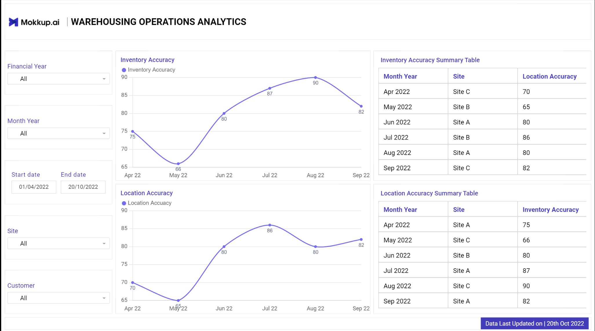

### Inventory

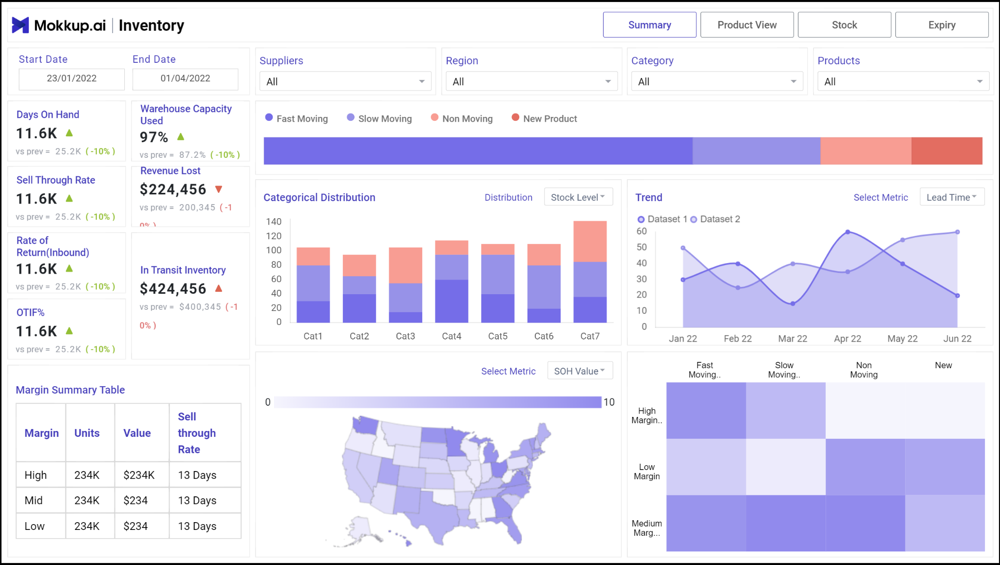

### Supplier Performance

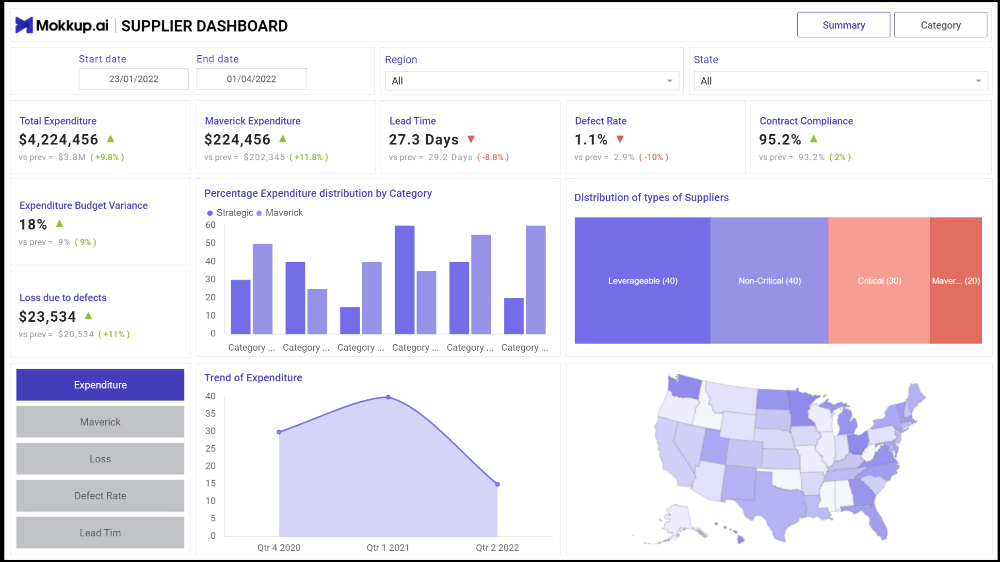

### Logisitics

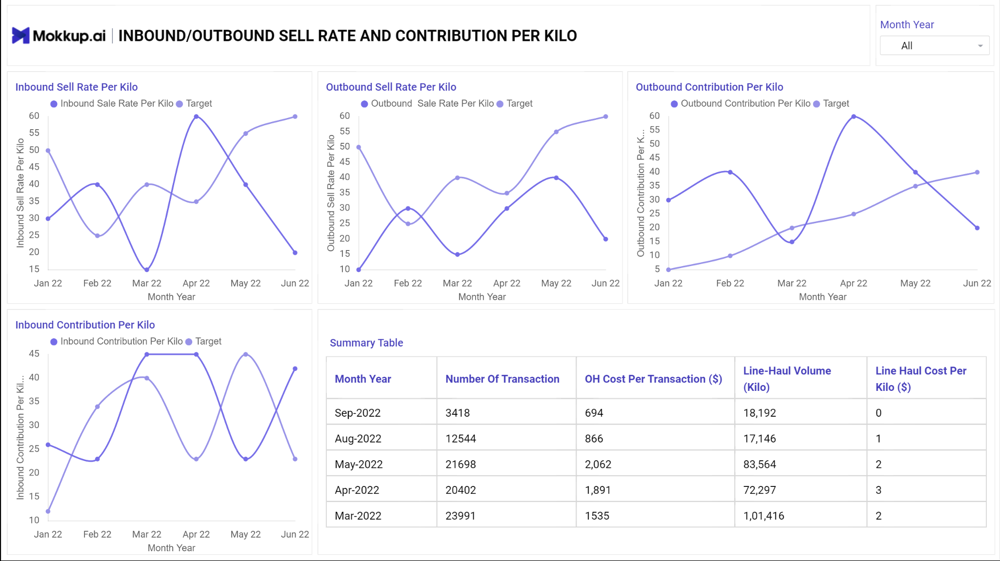


## Tools Used

| **Tool** | **Purpose** |
| --- | --- |
| Excel | Exploring the data |
| MySQL Server | Cleaning, testing, and analyzing the data |
| Power BI | Visualizing the data via interactive dashboards |
| GitHub | Hosting the project documentation |
| Mokkup AI | Designing the mockup of the dashboard |


# Development

## Pseudocode

## Pseudocode

- How can we approach the problem to create a solution from start to finish?

  1. Get the data from a reliable data source
  2. Explore the data in Excel to check for any errors that standout
  3. Load the data into SQL Server
  4. Clean the data with SQL
  5. Test the data with SQL
  6. Load the clean data into PowerBI
  7. Generate visualisations of the data in PowerBI
  8. Generate the findings based on the insights
  9. Write the documentation + commentary
  10. Publish the insights generated
 
## Data exploration notes

This is the stage where we scan the data for errors, inconcsistencies, bugs, weird and corrupted characters etc.

- The initial observations with this dataset are as follows:

1. The dataset contains 3000 records with information related to automotive logistics, including supplier details, part information, order dates, delivery dates, costs, and inventory details.
2. There are no missing values in any of the columns, indicating a complete dataset.
3. The dataset includes details about warehouse capacity and current inventory levels, which can be used to analyze inventory management efficiency and warehouse utilization.
4. Various transport modes are used, including Air, Sea, Road, and Rail. The distribution and cost implications of these modes need further analysis.
5. Outliers exist in numerical columns such as Quantity, UnitCost, TransportCost, TotalCost, and LeadTimeDays. These outliers need further analysis to decide whether to cap, remove, or treat them in some other manner.
6. We need to examine the correlations between numerical variables to identify potential relationships, particularly between costs, quantities, lead times, and transport modes.
7. We can also develop hypotheses related to supply chain performance, such as the impact of transport mode on costs and lead times, or the relationship between order quantities and total costs.


# Data Cleaning and Testing

The aim is to refine the dataset to ensure it is structured and ready for analysis. 

The cleaned data should meet the following criteria and constraints:

- Only relevant columns should be retained.
- All data types should be appropriate for the contents of each column.
- No column should contain null values, indicating complete data for all records.

Below is a table outlining the constraints on our cleaned dataset:

| **Property** | **Description** |
| --- | --- |
| Number of Rows | 3000 |
| Number of Columns | 18 |

And here is a tabular representation of the expected schema for the clean data:

| Column Name             | Data Type    | Description                                           |
|-------------------------|--------------|-------------------------------------------------------|
| `SupplierID`            | INT          | Unique identifier for the supplier                    |
| `PartID`                | INT          | Unique identifier for the part                        |
| `PartDescription`       | VARCHAR(255) | Description of the part                               |
| `OrderDate`             | DATETIME     | Date and time when the order was placed               |
| `EstimatedDeliveryDate` | DATETIME     | Estimated date and time of delivery                   |
| `ActualDeliveryDate`    | DATETIME     | Actual date and time of delivery                      |
| `Quantity`              | INT          | Quantity of parts ordered                             |
| `UnitCost`              | DECIMAL(10,2)| Cost per unit of the part                             |
| `TransportMode`         | VARCHAR(50)  | Mode of transport used for delivery (e.g., Air, Sea)  |
| `TransportCost`         | DECIMAL(10,2)| Cost of transport                                     |
| `WarehouseID`           | INT          | Unique identifier for the warehouse                   |
| `WarehouseLocation`     | VARCHAR(255) | Location of the warehouse                             |
| `WarehouseCapacity`     | INT          | Capacity of the warehouse in terms of storage units   |
| `CurrentInventory`      | INT          | Current inventory level in the warehouse              |
| `SupplierName`          | VARCHAR(255) | Name of the supplier                                  |
| `SupplierLocation`      | VARCHAR(255) | Location of the supplier                              |
| `TotalCost`             | DECIMAL(15,2)| Total cost for the order (Quantity * UnitCost)        |
| `LeadTimeDays`          | INT          | Lead time in days for the delivery                    |


- Steps taken to clean and shape the data into the desired format

  1. Convert Date Columns to Datetime Format
  2. Check for missing values
  3. Handle outliers
  4. Standardise text data
  5. Revalidate data types


## Transform and test the data

Before data transformation, a new database is created in the MySQL server. After the database is created, the raw data file is imported into the server using the table import wizard. After the import is complete, we can now being cleaning the data.

### Convert Date Columns to DateTime format

```sql
CREATE TABLE Cleaned_Automotive_Logistics (
    SupplierID INT,
    PartID INT,
    PartDescription VARCHAR(255),
    OrderDate DATETIME,
    EstimatedDeliveryDate DATETIME,
    ActualDeliveryDate DATETIME,
    Quantity INT,
    UnitCost DECIMAL(10, 2),
    TransportMode VARCHAR(50),
    TransportCost DECIMAL(10, 2),
    WarehouseID INT,
    WarehouseLocation VARCHAR(255),
    WarehouseCapacity INT,
    CurrentInventory INT,
    SupplierName VARCHAR(255),
    SupplierLocation VARCHAR(255),
    TotalCost DECIMAL(15, 2),
    LeadTimeDays INT
);

INSERT INTO Cleaned_Automotive_Logistics (
    SupplierID, PartID, PartDescription, OrderDate, EstimatedDeliveryDate,
    ActualDeliveryDate, Quantity, UnitCost, TransportMode, TransportCost,
    WarehouseID, WarehouseLocation, WarehouseCapacity, CurrentInventory,
    SupplierName, SupplierLocation, TotalCost, LeadTimeDays
)
SELECT 
    SupplierID, PartID, PartDescription,
    STR_TO_DATE(OrderDate, '%Y-%m-%d %H:%i:%s'),
    STR_TO_DATE(EstimatedDeliveryDate, '%Y-%m-%d %H:%i:%s'),
    STR_TO_DATE(ActualDeliveryDate, '%Y-%m-%d %H:%i:%s'),
    Quantity, UnitCost, TransportMode, TransportCost,
    WarehouseID, WarehouseLocation, WarehouseCapacity, CurrentInventory,
    SupplierName, SupplierLocation, TotalCost, LeadTimeDays
FROM Raw_Automotive_Logistics;
```

### Correct Invalid Date Ranges

```sql
UPDATE Cleaned_Automotive_Logistics
SET EstimatedDeliveryDate = ActualDeliveryDate, ActualDeliveryDate = EstimatedDeliveryDate
WHERE EstimatedDeliveryDate > ActualDeliveryDate;

-- Verify corrections
SELECT * FROM Cleaned_Automotive_Logistics
WHERE OrderDate > EstimatedDeliveryDate OR EstimatedDeliveryDate > ActualDeliveryDate;
```

### Handle Outliers

```sql
SET @row_num = 0;
SET @total_rows = (SELECT COUNT(*) FROM Cleaned_Automotive_Logistics);
SET @percentile_1 = 0.01 * @total_rows;
SET @percentile_99 = 0.99 * @total_rows;

SELECT *
FROM Cleaned_Automotive_Logistics
WHERE Quantity < (
  SELECT MIN(Quantity)
  FROM (
    SELECT Quantity,
           @row_num = @row_num + 1 AS row_num
    FROM Cleaned_Automotive_Logistics
    ORDER BY Quantity
  ) AS ordered
  WHERE row_num = CEIL(@percentile_1)
)
OR Quantity > (
  SELECT MAX(Quantity)
  FROM (
    SELECT Quantity,
           @row_num = @row_num + 1 AS row_num
    FROM Cleaned_Automotive_Logistics
    ORDER BY Quantity
  ) AS ordered
  WHERE row_num = CEIL(@percentile_99)
);
```
A similar check is done for all the other columns with numerical values

### Standardise Text Data

```sql
UPDATE Cleaned_Automotive_Logistics
SET PartDescription = UPPER(PartDescription),
    SupplierName = UPPER(SupplierName),
    WarehouseLocation = UPPER(WarehouseLocation),
    SupplierLocation = UPPER(SupplierLocation),
    TransportMode = UPPER(TransportMode);
```

### Data Consistency check

```sql
SELECT *, (Quantity * UnitCost) AS CalculatedTotalCost
FROM Cleaned_Automotive_Logistics
WHERE TotalCost != (Quantity * UnitCost);

-- Update TotalCost to correct discrepancies
UPDATE Cleaned_Automotive_Logistics
SET TotalCost = Quantity * UnitCost
WHERE TotalCost != (Quantity * UnitCost);
```

### Revalidate Data Types

```sql
DESCRIBE Cleaned_Automotive_Logistics;
```
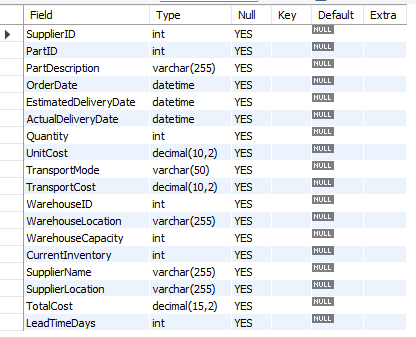

### Missing Values Check

```sql
SELECT * FROM Cleaned_Automotive_Logistics
WHERE OrderDate IS NULL OR EstimatedDeliveryDate IS NULL OR ActualDeliveryDate IS NULL 
OR Quantity IS NULL OR UnitCost IS NULL OR TransportMode IS NULL 
OR TransportCost IS NULL OR WarehouseID IS NULL OR WarehouseLocation IS NULL 
OR WarehouseCapacity IS NULL OR CurrentInventory IS NULL 
OR SupplierName IS NULL OR SupplierLocation IS NULL OR TotalCost IS NULL 
OR LeadTimeDays IS NULL;
```

### Data range Validation

```sql
-- Example for Quantity
SELECT MIN(Quantity), MAX(Quantity) FROM Cleaned_Automotive_Logistics;

-- Example for UnitCost
SELECT MIN(UnitCost), MAX(UnitCost) FROM Cleaned_Automotive_Logistics;

-- Example for TransportCost
SELECT MIN(TransportCost), MAX(TransportCost) FROM Cleaned_Automotive_Logistics;

-- Example for LeadTimeDays
SELECT MIN(LeadTimeDays), MAX(LeadTimeDays) FROM Cleaned_Automotive_Logistics;
```

### Sample queries

Now that the data is cleaned and tested for integrity, we can perform sample queries to ensure consitency and correctness. Here are a few queries that can be performed:

```sql
-- Query to get the total number of orders per supplier
SELECT SupplierID, SupplierName, COUNT(*) AS TotalOrders
FROM Cleaned_Automotive_Logistics
GROUP BY SupplierID, SupplierName;
```

```sql
-- Query to find the top 5 most expensive parts by unit cost
SELECT PartID, PartDescription, UnitCost
FROM Cleaned_Automotive_Logistics
ORDER BY UnitCost DESC
LIMIT 5;
```

```sql
-- Summary statistics for TransportCost
SELECT AVG(TransportCost) AS AvgTransportCost, MIN(TransportCost) AS MinTransportCost, MAX(TransportCost) AS MaxTransportCost, STDDEV(TransportCost) AS StdDevTransportCost
FROM Cleaned_Automotive_Logistics;
```


# Visualisation

## Results

- What does the Dashboard look like?
Below is a link to access the dashboard:

[PowerBI Dashboard](https://app.powerbi.com/view?r=eyJrIjoiYTUxMWU2MGQtNTJmZC00MGFhLWE4MzEtYTZkMTU0YzJjMjAyIiwidCI6ImI1MWY0MTY0LTE1M2ItNDhlYi05MWMyLTZiYzVmYTgxNmI0NiJ9)

The dashboard has been created with 6 different pages and an additional navigation pane. Here are the visuals for each of the pages:

### Navigation Pane

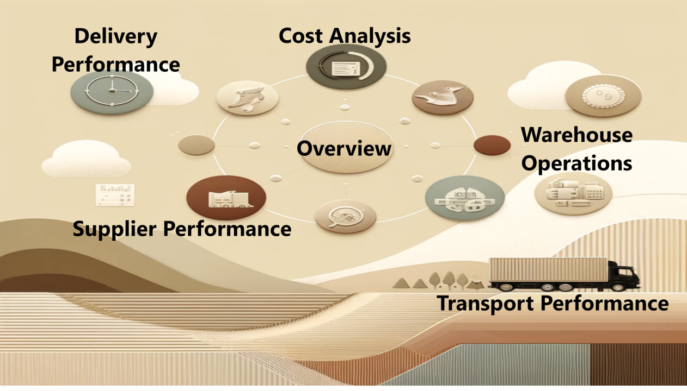

### Overview

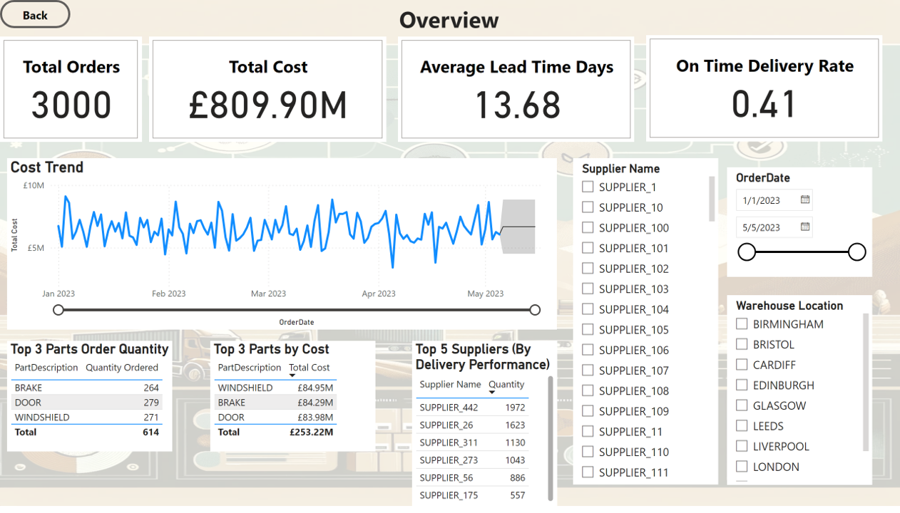

### Supplier Perfromance

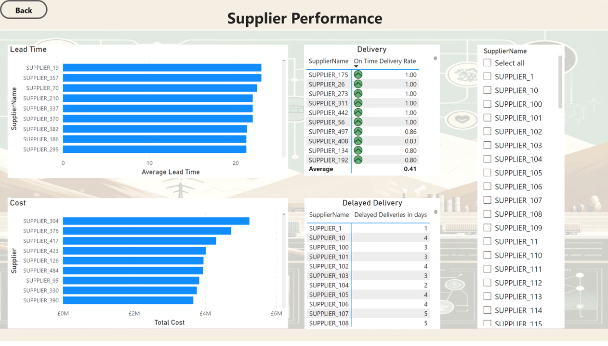

### Warehouse Operations

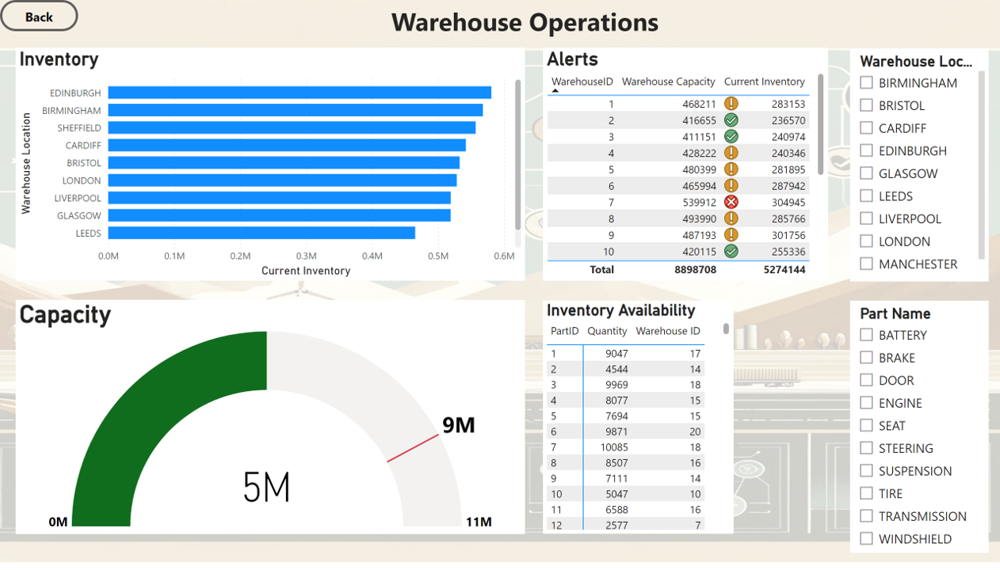

### Transport Performance

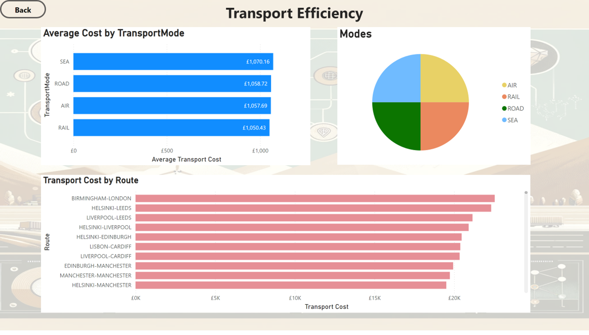

### Delivery Performance

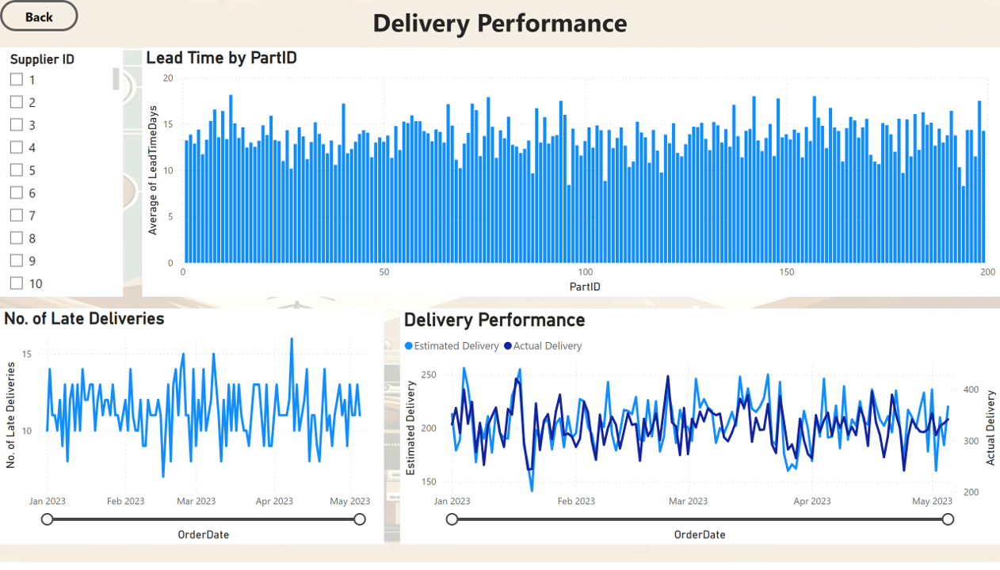

### Cost Analysis

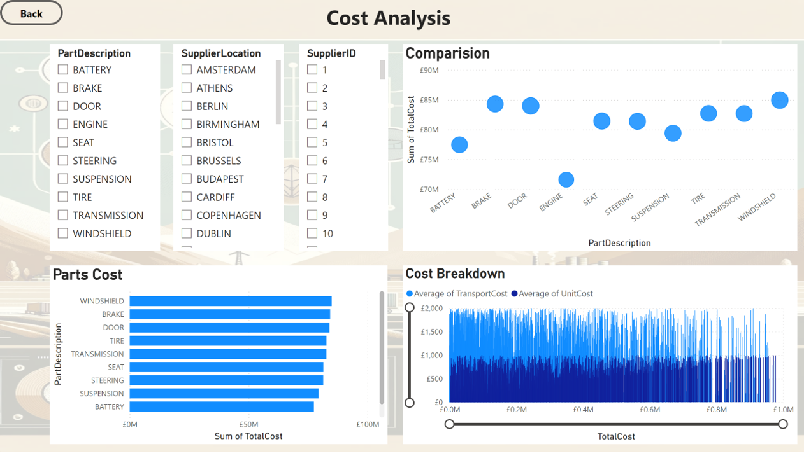


## Dax Measures

### 1. Order ID
```sql
OrderID = CONVERT('automotive_logistics cleaned_automotive_logistics'[SupplierID], STRING) & 
    "_" & 
    CONVERT('automotive_logistics cleaned_automotive_logistics'[PartID], STRING) & 
    "_" & 
    FORMAT('automotive_logistics cleaned_automotive_logistics'[OrderDate], "YYYYMMDD")
```

### 2. Route
```sql
Route = 'automotive_logistics cleaned_automotive_logistics'[SupplierLocation] & "-" & 'automotive_logistics cleaned_automotive_logistics'[WarehouseLocation]
```

### 3. On Time Delivery Rate
```sql
On Time Delivery Rate = 
VAR TotalOrders = COUNTROWS('automotive_logistics cleaned_automotive_logistics')
VAR OnTimeDeliveries = COUNTROWS(
    Filter(
        'automotive_logistics cleaned_automotive_logistics',
        'automotive_logistics cleaned_automotive_logistics'[ActualDeliveryDate] <= 'automotive_logistics cleaned_automotive_logistics'[EstimatedDeliveryDate]))
RETURN
DIVIDE(OnTimeDeliveries, TotalOrders, 0)
```

### 4. Inventory Utilisation
```sql
Inventory Utilisation = 
DIVIDE( 
    SUM('automotive_logistics cleaned_automotive_logistics'[CurrentInventory]),
    SUM('automotive_logistics cleaned_automotive_logistics'[WarehouseCapacity])
    )
```

### 5. Delayed deliveries
```sql
Delayed Deliveries = 
CALCULATE(
    COUNTROWS('automotive_logistics cleaned_automotive_logistics'),
    'automotive_logistics cleaned_automotive_logistics'[ActualDeliveryDate] > 'automotive_logistics cleaned_automotive_logistics'[EstimatedDeliveryDate]
)
```

### 6. Estimated delivery in days
```sql
Estimated delivery days = 
DATEDIFF('automotive_logistics cleaned_automotive_logistics'[OrderDate],'automotive_logistics cleaned_automotive_logistics'[EstimatedDeliveryDate],DAY)
```

### 7. Actual Delivery in days
```sql
Actual Delivery days = 
DATEDIFF('automotive_logistics cleaned_automotive_logistics'[OrderDate],'automotive_logistics cleaned_automotive_logistics'[ActualDeliveryDate],DAY)
```

### 8. Late Deliveries in days
```sql
Late Deliveries = 
'automotive_logistics cleaned_automotive_logistics'[Estimated delivery days] - 'automotive_logistics cleaned_automotive_logistics'[Actual Delivery days]
```


# Analysis

## Findings

- For this analysis, we are going to focus on the below questions to get the information we need:

1. Who are the top 5 suppliers by quantity supplied?
2. What are the top 3 parts ordered the most?
3. What is the average lead time?
4. What is the on time delivery rate?
5. Which mode of transport is the best option?
6. Which supplier is best for each category of the part?
7. Which warehouse has the best inventory turnover rate?

### 1. Top 5 suppliers by quanitty supplied

| **SupplierName** | **TotalQuantity** |
| --- | --- |
| SUPPLIER_376 | 8445 |
| SUPPLIER_390 | 7342 |
| SUPPLIER_126 | 7337 |
| SUPPLIER_55 | 7273 |
| SUPPLIER_304 | 6933 |

#### SQL Query
```sql

SELECT SupplierName, SUM(Quantity) AS TotalQuantity
FROM cleaned_automotive_logistics
GROUP BY SupplierName
ORDER BY TotalQuantity DESC
LIMIT 5;
```

### 2. Top 3 most ordered parts

| **PartDescription** | **TotalOrdered** |
| WINDSHIELD | 166922 |
| DOOR | 165268 |
| SEAT | 157901 |

#### SQL Query
```sql

SELECT PartDescription, SUM(Quantity) AS TotalOrdered
FROM cleaned_automotive_logistics
GROUP BY PartDescription
ORDER BY TotalOrdered DESC
LIMIT 3;
```

### 3. Average Lead Time

| **AverageLeadTime** |
| 13.6757 |

#### SQL Query
```sql

SELECT AVG(LeadTimeDays) AS AverageLeadTime
FROM cleaned_automotive_logistics;
```

### 4. On Time Delivery Rate

| **OnTimeDeliveryRate** |
| 40.53% |

#### SQL Query
```sql

SELECT 
  (SUM(CASE WHEN ActualDeliveryDate <= EstimatedDeliveryDate THEN 1 ELSE 0 END) / COUNT(*)) * 100 AS OnTimeDeliveryRate
FROM cleaned_automotive_logistics;
```

### 5. Best Transport Mode

| **TransportMode**| **AvgCost** |
| RAIL | 1050.43 |

#### SQL Query
```sql

SELECT TransportMode, AVG(TransportCost) AS AvgCost
FROM cleaned_automotive_logistics
GROUP BY TransportMode
ORDER BY AvgCost ASC
LIMIT 1;
```

### 6. Best Supplier for each part

| **PartDescription** |	**SupplierName** |	**AvgLeadTime** |
| BATTERY	| SUPPLIER_459	| 2.0000 |
| BRAKE	| SUPPLIER_228	| 2.0000 |
| DOOR	| SUPPLIER_176	| 2.0000 |
| ENGINE	| SUPPLIER_444	| 2.0000 |
| SEAT	| SUPPLIER_283	| 2.0000 |
| STEERING	| SUPPLIER_248	| 2.0000 |
| SUSPENSION	| SUPPLIER_397	| 2.0000 |
| TIRE	| SUPPLIER_234	| 2.0000 |
| TRANSMISSION	| SUPPLIER_54	| 2.0000 |
| WINDSHIELD	| SUPPLIER_427 |	2.0000 |

#### SQL Query
```sql

SELECT t.PartDescription, t.SupplierName, t.AvgLeadTime
FROM (
    SELECT PartDescription, SupplierName, AVG(LeadTimeDays) AS AvgLeadTime,
           ROW_NUMBER() OVER (PARTITION BY PartDescription ORDER BY AVG(LeadTimeDays)) AS rn
    FROM cleaned_automotive_logistics
    GROUP BY PartDescription, SupplierName
) t
WHERE t.rn = 1;
```

### 7. Top warehouse by turnover rate

| **WarehouseLocation** |	**InventoryTurnoverRate** |
| EDINBURGH |	97.6138 |
| BIRMINGHAM |	96.6727 |
| LONDON |	91.4150 |

#### SQL Query
```sql

SELECT WarehouseLocation, (SUM(Quantity) / AVG(CurrentInventory)) AS InventoryTurnoverRate
FROM cleaned_automotive_logistics
GROUP BY WarehouseLocation
ORDER BY InventoryTurnoverRate DESC
LIMIT 3;
```

## Discovery

We discovered that

1. The top 5 suppliers by quantity supplied are SUPPLIER_376, SUPPLIER_390, Supplier_126, Supplier_55, and Supplier_304, indicating their significant contribution to the supply chain.
2. The most ordered parts are Windshield, Door, and Seat, reflecting their high demand. The high demand for the secondary parts can indicate that there might be a shortage of supply.
3. The average lead time across all orders is approximately 14 days, suggesting a moderate waiting period between order placement and delivery.
4. The on-time delivery rate is approx. 40.53% indicating that majority of deliveries are delayed. More data around thie cause of dealy needs to be collected and analysed to improve hthe overall efficiency.
5. Rail Transport has been identified as the most cost effective mode of transport based on the average cost.
6. The best suppliers for each category has been identified based on the average lead time.
7. Best performing warehouse locations have been identified as Edinburgh, Birmingham and London, based on the inventory turnover rate. This indicated efficient inventory management and rapid stock movement.


# Reccommendations

1. Strengthen Supplier Relationships
   Develop strategic long-term partnerships with the top 5 suppliers (SUPPLIER_376, SUPPLIER_390, Supplier_126, Supplier_55, and Supplier_304) to ensure reliable supply and negotiate better terms. Utilise tools like the Kraljic Matrix and    Dutch Windmill framework for strategic design of the partership framework.
2. Focus on High-Demand Parts
   Increase the stock levels of the most ordered parts (Windshield, Door, and Seat) to meet high demand and prevent potential shortages.
3. Reduce Lead Time
   Implement process improvements and work closely with suppliers to reduce the average lead time, aiming for a target below the current 14-day average.
4. Improve On-Time Delivery Rate
   Investigate the reasons behind the low on-time delivery rate (40.53%) and implement corrective actions such as better planning, improved communication with suppliers, and enhanced logistics coordination.
5. Optimize Transport Costs
   Utilize rail transport more frequently as it has been identified as the most cost-effective mode, balancing cost savings with delivery speed and reliability.
6. Leverage Best Suppliers for Each Part Category
   Ensure that the identified best suppliers for each part category are prioritized in procurement to maintain low lead times and high-quality standards.
7. Adopt Best Practices in Inventory Management
   Implement inventory management practices from the top-performing warehouses (Edinburgh, Birmingham, and London) across all locations to improve turnover rates and reduce holding costs.


## Action Plan

1. Supplier Relationship Management

- Schedule quarterly business reviews with the top 5 suppliers to discuss performance, expectations, and opportunities for improvement.
- Negotiate long-term contracts with favorable terms based on volume discounts and service-level agreements.

2. Inventory Optimization for High-Demand Parts

- Conduct a demand forecasting analysis to accurately predict future needs for Windshield, Door, and Seat.
- Increase safety stock levels for these parts and review reorder points regularly to ensure timely replenishment.

3. Lead Time Reduction Initiatives

- Map the entire supply chain process to identify bottlenecks and implement lean manufacturing principles to streamline operations.
- Collaborate with suppliers to adopt just-in-time (JIT) delivery practices where feasible.

4. Enhance Delivery Performance

- Implement a real-time tracking system for shipments to monitor delivery performance.
- Set up a task force to analyze late deliveries and develop targeted improvement plans.
- Offer incentives to suppliers for meeting or exceeding on-time delivery targets.

5. Cost-Effective Transport Solutions

- Review the transport mix and increase the use of rail transport for routes where it is most beneficial.
- Negotiate with logistics providers for better rates and service levels for rail transport.

6. Supplier Selection and Management

- Establish a supplier scorecard to regularly evaluate suppliers based on lead time, quality, cost, and reliability.
- Create a preferred supplier list for each part category and ensure procurement teams adhere to it.

7. Inventory Management Enhancement

- Conduct training sessions for warehouse staff on best practices in inventory management observed in the top-performing warehouses.
- Implement advanced inventory management systems (IMS) to automate tracking and improve accuracy.
- Regularly review and adjust inventory policies based on performance data and turnover rates.


## Key Performance Indicators (KPIs) and Monitoring Methods

1. Supplier Relationship Management

**KPIs**
- Supplier Performance Score: A composite score based on quality, delivery, and cost metrics.
- Contract Compliance Rate: Percentage of suppliers adhering to contract terms.
- Quarterly Business Review Attendance: Number of reviews held with key suppliers.

**Monitoring Methods**
- Use a supplier management software to track performance scores and compliance.
- Schedule and document quarterly business reviews in a centralized calendar.
- Regularly update and review supplier scorecards.

2. Inventory Optimization for High-Demand Parts

**KPIs**
- Stockout Rate: Frequency of stockouts for high-demand parts.
- Inventory Turnover Ratio: How often inventory is sold and replaced over a period.
- Safety Stock Levels: Actual vs. target safety stock levels.

**Monitoring Methods**
- Implement an inventory management system (IMS) to track stock levels in real-time.
- Set automatic alerts for low stock levels to prevent stockouts.
- Conduct monthly reviews of inventory turnover ratios and adjust safety stock levels accordingly.

3. Lead Time Reduction Initiatives

**KPIs**
- Average Lead Time: The average number of days between order placement and delivery.
- Lead Time Variability: The consistency of lead times (measured by standard deviation).
- On-Time Delivery Improvement: Percentage reduction in late deliveries.

**Monitoring Methods**
- Use project management tools to map and monitor supply chain processes.
- Implement process improvement methodologies (e.g., Lean, Six Sigma) and track project progress.
- Regularly analyze lead time data and adjust strategies as needed.

4. Enhance Delivery Performance

**KPIs**
- On-Time Delivery Rate: Percentage of orders delivered on or before the estimated delivery date.
- Delivery Accuracy: Percentage of deliveries meeting quality and quantity specifications.
- Customer Satisfaction Score: Feedback from internal and external customers regarding delivery performance.

**Monitoring Methods**
- Implement a real-time shipment tracking system.
- Conduct root cause analysis for late deliveries and develop corrective action plans.
- Collect and review customer feedback regularly through surveys and direct communication.

5. Cost-Effective Transport Solutions

**KPIs**
- Transport Cost per Unit: Average cost of transporting goods per unit.
- Mode Utilization Rate: Percentage use of cost-effective transport modes (e.g., rail).
- Freight Efficiency: Ratio of transport cost to distance covered or weight transported.

**Monitoring Methods**
- Use transport management systems (TMS) to track transport costs and modes.
- Negotiate and document contracts with logistics providers in a centralized system.
- Regularly review transport cost reports and adjust transport strategies.

6. Supplier Selection and Management

**KPIs**
- Supplier Lead Time: Average lead time per supplier.
- Quality Rejection Rate: Percentage of parts rejected due to quality issues.
- Preferred Supplier Utilization Rate: Percentage of purchases made from preferred suppliers.

**Monitoring Methods**
- Maintain a database of supplier performance metrics and update it regularly.
- Conduct regular audits of supplier performance against the scorecard criteria.
- Track procurement data to ensure adherence to the preferred supplier list.

7. Inventory Management Enhancement

**KPIs**
- Inventory Accuracy: Percentage accuracy of inventory records compared to physical counts.
- Order Fulfillment Rate: Percentage of orders fulfilled without delays.
- Inventory Turnover Improvement: Improvement in inventory turnover ratio over time.

**Monitoring Methods**
- Use an advanced IMS to automate inventory tracking and reporting.
- Schedule regular training sessions for warehouse staff on inventory best practices.
- Conduct periodic audits of inventory records and physical counts to ensure accuracy.


# Conclusion

This project aimed to optimize the logistics and supply chain processes for a vehicle manufacturer. By analyzing supplier performance, inventory turnover, transportation costs, and delivery efficiency, we identified key areas for improvement. The top suppliers were highlighted for strategic partnership development, and high-demand parts were pinpointed for inventory optimization. We discovered that the average lead time and on-time delivery rates needed significant improvement. Rail transport emerged as the most cost-effective mode. Based on these insights, we formulated a comprehensive set of recommendations and an actionable plan to enhance supply chain efficiency, reduce costs, and ensure timely delivery of parts and components. Implementing these strategies will support Just-In-Time (JIT) manufacturing and overall operational excellence.
